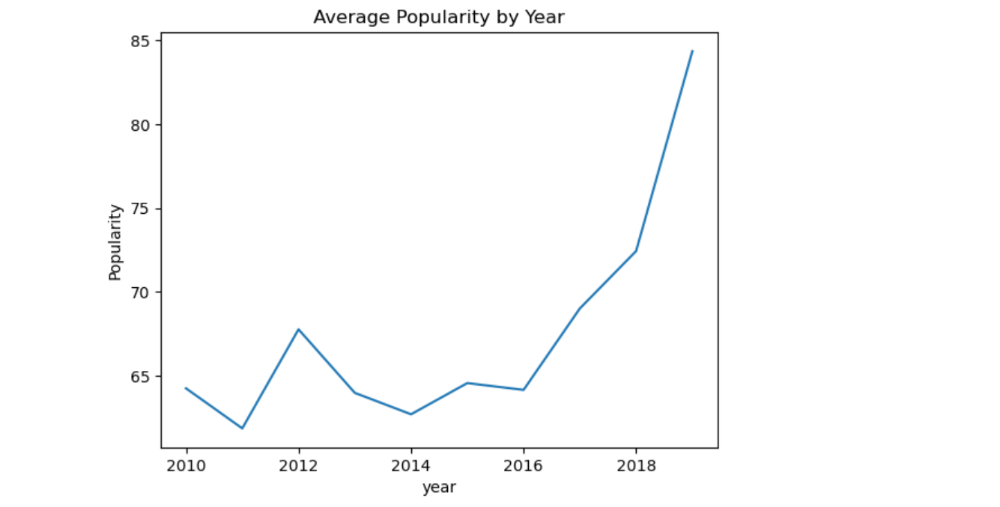
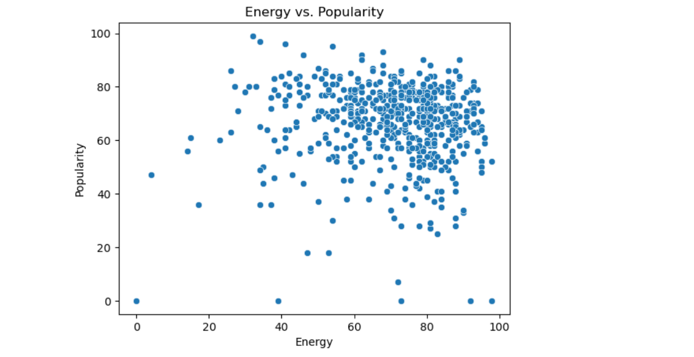

# Spotify Data Analysis (2010-2019)
This project performs an exploratory data analysis (EDA) on a dataset of the most popular Spotify songs from 2010 to 2019. The goal is to uncover patterns in genre distribution, popularity trends, and audio features using Python visualizations.

---

## Dataset
- **Source:** [Top Spotify Songs from 2010 to 2019 - Kaggle] (https://www.kaggle.com/datasets/leonardopena/top-spotify-songs-from-20102019-by-year)
- **Size:** 603 songs
- **Features:** Title, Artist, Genre, Popularity, BPM, Energy, Danceability, Valence, Duration, etc.

---

## Key Findings
- **Dance Pop** is the most dominant genre by frequency and average popularity
- **Popularity has increased over time**, peaking in 2019
- **No single audio feature** strongly predicts popularity, though combinations (like high energy & high danceability) may have some influence
- **External factors** such as playlist placement and artist recognition likely play a major role in success

---

## Tools Used
- Python
- Pandas
- Matplotlib & Seaborn
- Jupyter Notebook

---

## Sample Visuals

### Popularity by Year
This line chart shows how the average popularity of top Spotify songs evolved from 2010 to 2019. There is a noticeable upward trend, peaking in 2019.

---
### Energy vs. Popularity
This scatter plot explores the relationship between a song's energy level and its popularity score. While there’s a concentration in the upper-right quadrant, the correlation remains weak, suggesting other factors influence song success.

---

## Future Improvements
- Build a model to predict popularity using audio features
- Include playlist and social media engagement metrics

---

## Author
**Jeily Antigua**  
[LinkedIn](https://www.linkedin.com/in/jeilyantigua) | [Portfolio]()
